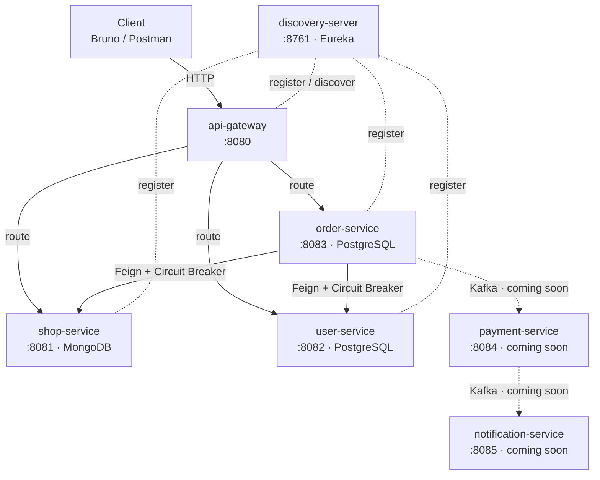
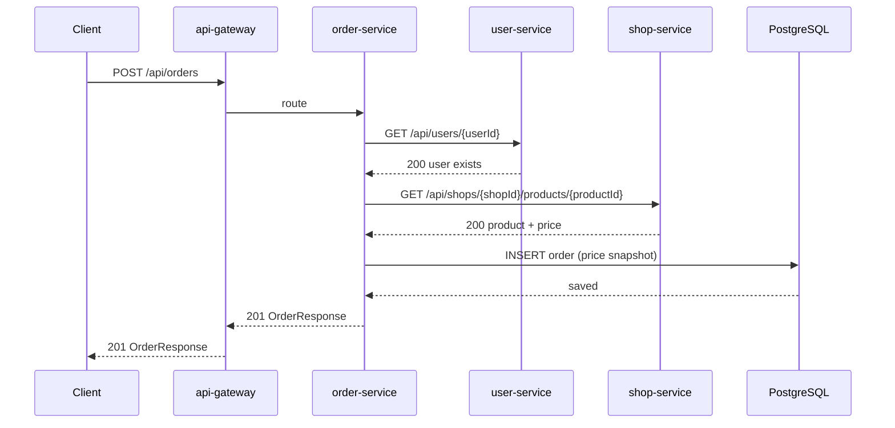

# LocalMart — Local Shop Marketplace

A microservices platform connecting neighborhood shops with local customers.
Shops list products, customers browse and place orders — each concern handled by its own independent service.

Built with **Java 21 + Spring Boot 4 + Spring Cloud** (Java services) and **.NET 8** (coming soon).

---

## How It Works



All services register with **Eureka** on startup. The API Gateway discovers them from Eureka and routes by service name — no hardcoded URLs anywhere.

---

## Services

| Service              | Port | Language    | Database   | What it does                                          | Status      |
| -------------------- | ---- | ----------- | ---------- | ----------------------------------------------------- | ----------- |
| discovery-server     | 8761 | Java/Spring | —          | Eureka service registry — all services register here  | Live        |
| api-gateway          | 8080 | Java/Spring | —          | Single entry point — routes to downstream services    | Live        |
| shop-service         | 8081 | Java/Spring | MongoDB    | Manage shops and their product catalog                | Live        |
| user-service         | 8082 | Java/Spring | PostgreSQL | Register and manage customer/shop owner profiles      | Live        |
| order-service        | 8083 | Java/Spring | PostgreSQL | Place orders — calls shop and user service via Feign  | Live        |
| payment-service      | 8084 | .NET 8      | PostgreSQL | Process payments — async via Kafka (Saga pattern)     | Coming soon |
| notification-service | 8085 | .NET 8      | MongoDB    | Email/SMS notifications triggered by events           | Coming soon |

---

## Core Flow: Placing an Order



1. **Validate user** — Feign call to user-service → confirms the userId exists and is active
2. **Fetch product** — Feign call to shop-service → gets current product details and price
3. **Price snapshot** — `productName` and `unitPrice` are copied into the order at placement time. Future price changes do not affect existing orders.
4. **Save order** — persisted in PostgreSQL with status `PENDING`

If user-service or shop-service is **unreachable** (connection failure, not a 404), the circuit breaker opens after 5 consecutive failures. Subsequent calls fail instantly with HTTP 503 — no timeout wait, no thread blocking, and the downstream service gets time to recover.

---

## Prerequisites

- Java 21
- Maven 3.9+
- Docker Desktop
- Bruno API client — <https://www.usebruno.com>

---

## Setup

### 1. Start infrastructure

```bash
docker compose -f docker-compose.infra.yml up -d
```

| Container     | Purpose               | Port  |
| ------------- | --------------------- | ----- |
| PostgreSQL 16 | Relational DB         | 5432  |
| MongoDB 7     | Document DB           | 27017 |
| pgAdmin 4     | PostgreSQL browser UI | 5050  |
| mongo-express | MongoDB browser UI    | 8091  |

### 2. Create PostgreSQL databases

```bash
docker exec -it localmart-postgres psql -U localmart -c "CREATE DATABASE localmart_users;"
docker exec -it localmart-postgres psql -U localmart -c "CREATE DATABASE localmart_orders;"
```

> MongoDB: shop-service creates its own collections on first run automatically.

### 3. Build all services

```bash
mvn clean install -DskipTests
```

### 4. Start services — each in its own terminal

```bash
mvn spring-boot:run -pl discovery-server   # start this first
mvn spring-boot:run -pl api-gateway
mvn spring-boot:run -pl shop-service
mvn spring-boot:run -pl user-service
mvn spring-boot:run -pl order-service
```

---

## Verify Everything Is Up

### Service URLs

| URL                                      | What you should see                    |
| ---------------------------------------- | -------------------------------------- |
| <http://localhost:8761>                  | Eureka dashboard — all services listed |
| <http://localhost:8081/swagger-ui.html>  | Shop Service API docs                  |
| <http://localhost:8082/swagger-ui.html>  | User Service API docs                  |
| <http://localhost:8083/swagger-ui.html>  | Order Service API docs                 |
| <http://localhost:8081/actuator/health>  | `{"status":"UP"}`                      |

### Database GUIs

| URL                      | Tool          | Login                              |
| ------------------------ | ------------- | ---------------------------------- |
| <http://localhost:5050>  | pgAdmin 4     | `admin@localmart.dev` / `admin123` |
| <http://localhost:8091>  | mongo-express | `admin` / `pass`                   |

> **pgAdmin first-time setup:** after login, right-click Servers → Register → Server.
> Connection: host `localmart-postgres`, port `5432`, user `localmart`, password `localmart123`.

### Circuit Breaker (order-service)

| URL                                                                | What you should see                       |
| ------------------------------------------------------------------ | ----------------------------------------- |
| <http://localhost:8083/actuator/circuitbreakers>                   | State of each CB instance (CLOSED / OPEN) |
| <http://localhost:8083/actuator/circuitbreakerevents/user-service> | Recent call events                        |

---

## API Endpoints

### Shop Service — `/api/shops`

| Method | Path                                             | Description           |
| ------ | ------------------------------------------------ | --------------------- |
| POST   | `/api/shops`                                     | Register a shop       |
| GET    | `/api/shops`                                     | List all active shops |
| GET    | `/api/shops/{shopId}`                            | Get shop by ID        |
| DELETE | `/api/shops/{shopId}`                            | Soft-delete a shop    |
| POST   | `/api/shops/{shopId}/products`                   | Add product to shop   |
| GET    | `/api/shops/{shopId}/products`                   | List shop products    |
| GET    | `/api/shops/{shopId}/products/{productId}`       | Get product by ID     |
| PATCH  | `/api/shops/{shopId}/products/{productId}/stock` | Update stock          |
| DELETE | `/api/shops/{shopId}/products/{productId}`       | Delete product        |

### User Service — `/api/users`

| Method | Path              | Description               |
| ------ | ----------------- | ------------------------- |
| POST   | `/api/users`      | Register a user           |
| GET    | `/api/users`      | List all active users     |
| GET    | `/api/users/{id}` | Get user by ID            |
| PUT    | `/api/users/{id}` | Update name/phone/address |
| DELETE | `/api/users/{id}` | Soft-delete a user        |

### Order Service — `/api/orders`

| Method | Path                          | Description                      |
| ------ | ----------------------------- | -------------------------------- |
| POST   | `/api/orders`                 | Place an order                   |
| GET    | `/api/orders/{id}`            | Get order by ID                  |
| GET    | `/api/orders?userId={uuid}`   | Get all orders for a customer    |
| GET    | `/api/orders?shopId={shopId}` | Get all orders for a shop        |
| PATCH  | `/api/orders/{id}/status`     | Update order status              |

---

## Key Design Decisions

**No cross-service foreign keys** — `userId` stored in the orders table has no database-level FK pointing to the users database. Services own their data independently. Integrity is enforced in code via Feign calls at order creation time.

**Price snapshot** — product name and price are copied into the order at placement time. The order is a historical record — it is not affected by future price edits.

**Soft delete for shops and users** — `active = false` instead of physical deletion, because order history references these IDs and must remain intact. Products use hard delete — the same product name must be re-addable after deletion.

**Circuit breaker (4xx vs 5xx)** — only infrastructure failures (connection refused, 5xx) count toward the failure rate and open the circuit. Business errors like "user not found" (404) are ignored by the circuit breaker — the downstream service is healthy, just the request data is wrong.

**Error format** — all services return [RFC 7807 ProblemDetail](https://datatracker.ietf.org/doc/html/rfc7807) errors. Consistent shape across every endpoint and every service.

**UTC everywhere** — all timestamps are stored and returned in UTC. `TimeZone.setDefault(UTC)` runs before Spring context loads in each service.

---

## Databases

| Database         | Service                    | Credentials                              |
| ---------------- | -------------------------- | ---------------------------------------- |
| shop-service     | shop-service (MongoDB)     | user: `localmart` / pass: `localmart123` |
| localmart_users  | user-service (PostgreSQL)  | user: `localmart` / pass: `localmart123` |
| localmart_orders | order-service (PostgreSQL) | user: `localmart` / pass: `localmart123` |

Flyway manages schema migrations automatically on startup for PostgreSQL services.
Migration files live in `src/main/resources/db/migration/`.

---

## Build Reference

```bash
# Build everything
mvn clean install -DskipTests

# Build a single service (and its parent)
mvn clean install -DskipTests -pl order-service -am

# Run a specific service
mvn spring-boot:run -pl shop-service

# Run tests
mvn test -pl order-service
```

---

## Roadmap

**Live:** service discovery, API gateway, shop catalog, user profiles, order management with synchronous inter-service calls and circuit breaking.

**Coming soon:** async payment processing (Kafka + Saga pattern), email/SMS notifications, distributed tracing, metrics dashboards, authentication (Keycloak), full Docker Compose, and Azure AKS deployment.
